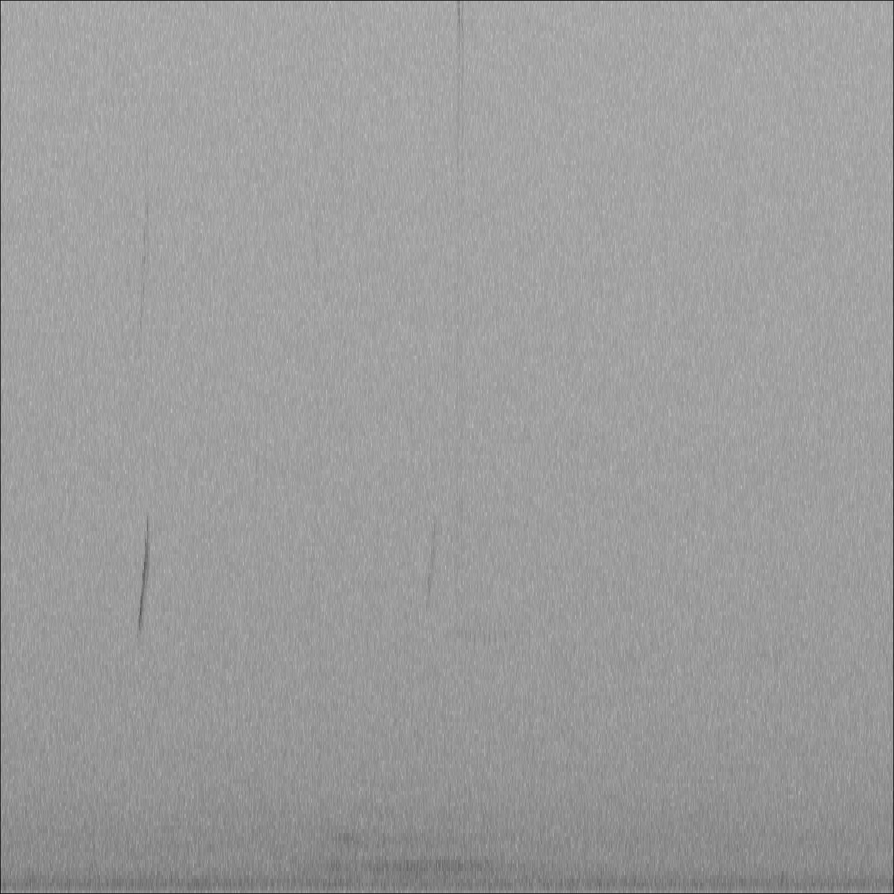
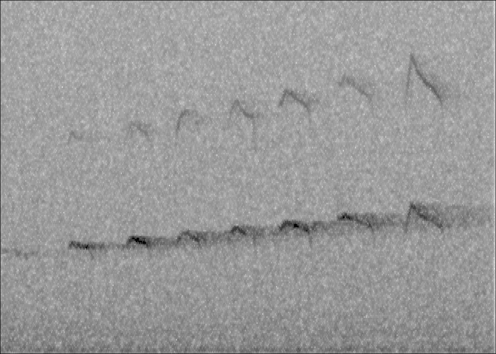
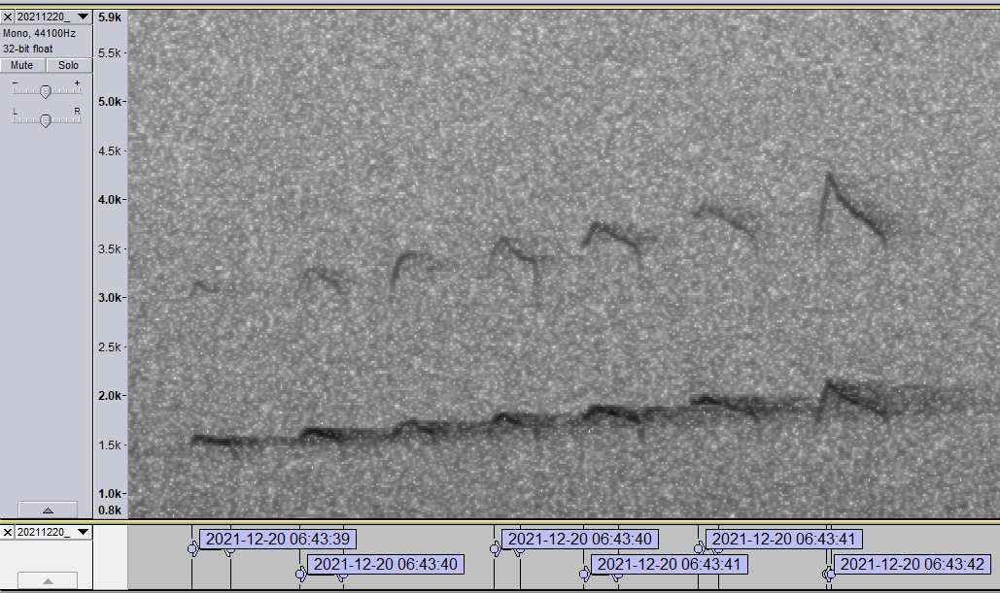
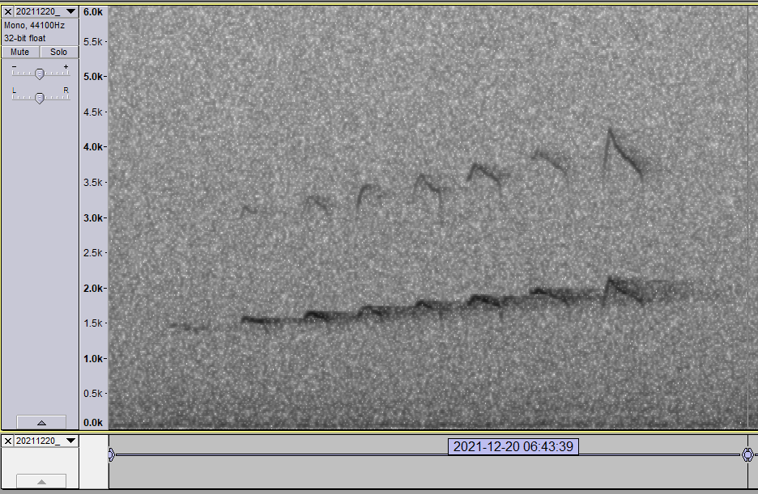

## NocMigR package

------------------------------------------------------------------------

This package is in a *very* preliminary state and provides some
workflows for processing large sound files (e.g., `NocMig`, `NFC`,
`AudioMoth`), with a main emphasis on automatising the detection of
events (i.e., extracting calls with time-stamps) that can be easily
reviewed in [Audacity](https://www.audacityteam.org/). **Note: On the
occasion of some recent changes to the data privacy policy and ownership
of Audacity I highly suggest to stick to version 3.0.2!**

**All major computation steps are carried out by sophisticated libraries
called in the background. Including:**

-   **R packages**

-   [bioacoustics](https://cran.r-project.org/package=bioacoustics)

-   [tuneR](https://cran.r-project.org/package=tuneR)

-   [seewave](https://cran.r-project.org/package=seewave)

-   [Warbler](https://cran.r-project.org/package=warbleR)

-   **python packages**

-   [audioop](https://docs.python.org/3/library/audioop.html)

-   [pydub](https://github.com/jiaaro/pydub)

To install the package, use …

``` r
devtools::install_github("mottensmann/NocMigR")
```

## Examples and documentation of main functions

------------------------------------------------------------------------

Load the package once installed …

``` r
library(NocMigR)
```

### Load example audio

The package contains an example file captured using an
[AudioMoth](https://www.openacousticdevices.info/) recorder. To reduce
file size, a segment of five minutes was downsampled to 44.1 kHz and
saved as 128 kbps mp3 file. In addition to a lot of noise there is short
segment of interest (scale call of a Eurasian Pygmy Owl *Glaucidium
passerinum*).

``` r
## get path to test_audio.mp3
path <- system.file("extdata", "20211220_064253.mp3", package = "NocMigR")
## create temp folder
dir.create("example")
## copy to test_folder
file.copy(path, "example")
## convert to wav
bioacoustics::mp3_to_wav("example/20211220_064253.mp3", delete = T)
```

Plot spectro to see there is a lot of noise and a few spikes reflecting
actual signals …

``` r
## read audio
audio <- tuneR::readWave("example/20211220_064253.wav")
## plot spectrum
bioacoustics::spectro(audio, FFT_size = 2048, flim = c(0, 5000))
```



### 1.) `rename_recording`

Naming files using a string that combines the recording date and
starting time (`YYYYMMDD_HHMMSS`) is convenient for archiving and
analysing audio files (e.g, default of
[AudioMoth](https://www.openacousticdevices.info/)). Some (most?) of the
popular field recorders (e.g., Olympus LS, Tascam DR or Sony PCM) use
different, rather uninformative naming schemes (date and number at
best), but the relevant information to construct a proper date_time
string is embedded in the meta data of the recording (accessible using
`file.info()`, but requires correct settings of the internal clock!).
For instance, long recording sessions using an Olympus LS-3 will create
multiple files, all of which share the same creation and modification
times (with respect to the first recording). By contrast, the Sony
PCM-D100 saves files individuals (i.e, all have unique ctimes and
mtimes). Presets to rename files are available for both types described
here.

``` r
## only simulate output as file is already labelled
rename_recording(path = "example",
                 format = "wav",
                 recorder = "Sony PCM-D100",
                 simulate = T)
#>                                        old.name  seconds                time
#> example/20211220_064253.wav 20211220_064253.wav 300.0686 2022-09-27 13:45:55
#>                                        new.name
#> example/20211220_064253.wav 20220927_134555.wav
```

### 2.) `split_wave`: Divide long recordings

This function allows to split long audio recordings into smaller chunks
for processing with `bioacoustics::threshold_detection`. To keep the
time information, files are written with the corresponding starting
time. \*The task is performed using a python script queried using
[reticulate](https://cran.r-project.org/package=reticulate)

``` r
## split in segments
split_wave(file = "20211220_064253.wav", # which file
           path = "example", # where to find it
           segment = 30, # cut in 30 sec segments
           downsample = 32000) # resample at 32000
#> 
#> Downsampling of 20211220_064253.wav to 32000 Hz...   done
#> Split ...

## show files
list.files("example/split/")
#>  [1] "20211220_064253.WAV" "20211220_064323.WAV" "20211220_064353.WAV"
#>  [4] "20211220_064423.WAV" "20211220_064453.WAV" "20211220_064523.WAV"
#>  [7] "20211220_064553.WAV" "20211220_064623.WAV" "20211220_064653.WAV"
#> [10] "20211220_064723.WAV" "20211220_064753.WAV"
## delete folder
unlink("example/split", recursive = TRUE)
```

### 3.) `find events`: Identify signals of interest

This functions is a wrapper to `bioacoustics::threshold_detection()`
aiming at extracting calls based on the signal to noise ratio and some
target-specific assumptions about approximate call frequencies and
durations. Check `?bioacoustics::threshold_detection()` for details.
**Note, only some of the parameters that are defined in
`bioacoustics::threshold_detection()` are used right know**. *For long
recordings (i.e, several hours) it makes sense to run on segments as
created before to avoid memory issues. Here we use the demo sound file
as it is*

``` r
## run detection threshold algorithm
TD <- find_events(wav.file = "example/20211220_064253.wav",
                  threshold = 8, # Signal-to-noise ratio in db
                  min_dur = 20, # min length in ms
                  max_dur = 300, # max length in ms
                  LPF = 5000, # low-pass filter at 500 Hz
                  HPF = 1000) # high-pass filter at 4 kHz

## Review events 
head(TD$data$event_data[,c("filename", "starting_time", "duration", "freq_max_amp")])
#>              filename starting_time  duration freq_max_amp
#> 1 20211220_064253.wav  00:00:46.576 168.34467     1477.762
#> 2 20211220_064253.wav  00:00:47.045 190.11338     1646.544
#> 3 20211220_064253.wav  00:00:47.887 116.82540     1790.127
#> 4 20211220_064253.wav  00:00:48.277 150.92971     1827.046
#> 5 20211220_064253.wav  00:00:48.774  91.42857     1964.311
#> 6 20211220_064253.wav  00:00:49.332  21.04308     2264.046

## display spectrogram based on approximate location of first six events
audio <- tuneR::readWave("example/20211220_064253.wav",
                         from = 46,
                         to = 50,
                         units = "seconds")
bioacoustics::spectro(audio, FFT_size = 2048, flim = c(0, 5000))
```



In addition to the output shown above, a file with labels for reviewing
events in `Audacity` is created (wrapping `seewave::write.audacity()`).



### 4.) `extract_events`: Subset original recording file

Refines the output of `find_events` by first adding a buffer (default 1
second on both sides of the event) and subsequently merging overlapping
selections to make the output more pretty. Additionally, allows to
filter based on expected frequencies (i.e., checks maximum amplitude
frequency is within the frequency band defined by `HPF:LPF`)

``` r
## extract events based on object TD
df <- extract_events(threshold_detection = TD, 
                     path = "example",
                     format = "wav",
                     LPF = 4000,
                     HPF = 1000,
                     buffer = 1)
#> 6 selections overlapped
```

Display refined events …

``` r
## display spectrogram based on first six events
audio <- tuneR::readWave("example/20211220_064253.wav", 
                         from = df$from,
                         to = df$to,
                         units = "seconds")
bioacoustics::spectro(audio, FFT_size = 2048, flim = c(0, 5000))
```




### 5.) `merge_events`: Pool all detected events

Takes the output of the previous operation and concatenates audio
signals as well as labels into files called `merged.events.wav` and
`merged.events.txt` respectively. This option comes handy if there are
many input files in the working directory.

``` r
merge_events(path = "example")
```

## `batch_process`: Entire workflow combined in a single function call

Process all files within a directory and run the steps shown above

``` r
batch_process(
  path = "example",
  format = "wav",
  segment = NULL,
  downsample = NULL,
  SNR = 8,
  target = data.frame(min_dur = 20, # min length in ms
                      max_dur = 300, # max length in ms
                      LPF = 5000, # low-pass filter at 500 Hz
                      HPF = 1000),
  rename = FALSE)
#> Start processing:     2022-09-27 13:46:06     [Input audio 5 minutes @ 44100 Hz ]
#> Search for events ...
#> done
#> Extract events ... 
#> 
#> Existing files '_extracted.WAV will be overwritten!
#> 8 selections overlapped
#> In total 1 events detected
#> Merge events and write audio example/merged_events.WAV
#> 
#> Existing files merged_events.WAV  will be overwritten!
#> Finished processing:  2022-09-27 13:46:07 
#>  Run time:    1.34 seconds
#>              filename    from        to       starting_time   event
#> 1 20211220_064253.wav  45.576  47.62258 2021-12-20 06:43:39  46.576
#> 2 20211220_064253.wav  46.045  48.09204 2021-12-20 06:43:40  47.045
#> 3 20211220_064253.wav  46.887  49.32528 2021-12-20 06:43:40  47.887
#> 4 20211220_064253.wav  47.774  49.82277 2021-12-20 06:43:41  48.774
#> 5 20211220_064253.wav  48.332  50.38133 2021-12-20 06:43:42  49.332
#> 6 20211220_064253.wav 152.434 156.35420 2021-12-20 06:45:26 153.434
```

| Recording | Sample.rate | Downsampled | Channels | Run.time |
|:---------:|:-----------:|:-----------:|:--------:|:--------:|
|   60 h    |  96000 Hz   |  441000 Hz  |   Mono   |  2.02 h  |
|   60 h    |  96000 Hz   |  441000 Hz  |   Mono   |  1.76 h  |
|   11.91   |  96000 Hz   |  441000 Hz  |  Stereo  |  1.39 h  |
|  10.6 h   |  96000 Hz   |  441000 Hz  |   Mono   |  1.3 h   |
|   2.73    |  96000 Hz   |  441000 Hz  |   Mono   | 4.88 min |

Run times all steps, notebook \~ Intel i5-4210M, 2 cores \~ 8 GB RAM

| Recording | Sample.rate | Downsampled | Channels | Run.time  |
|:---------:|:-----------:|:-----------:|:--------:|:---------:|
|   7.5 h   |  96000 Hz   |  441000 Hz  |   Mono   | 14.52 min |

Run times only event detection, notebook \~ Intel i5-4210M, 2 cores \~ 8
GB RAM

**Update:**

With adequate computational power there is no need to split large wave
files into segments of one hour. This way, the event detection process
is much faster (steps 3:6), usually less than four minutes for an entire
NocMig night!

    #> 
    #> 
    #> | Recording | Sample.rate | Downsampled | Channels | Run.time  |
    #> |:---------:|:-----------:|:-----------:|:--------:|:---------:|
    #> | 114.99 h  |  48000 Hz   |  441000 Hz  |   Mono   | 26.79 min |
    #> 
    #> Table: 115h AudioMoth recording, notebook ~ AMD RYZEN 7, 16 cores ~ 24 GB RAM

## `Header for observation lists on ornitho.de`

Retrieve weather data via [Bright Sky](https://brightsky.dev/) (de
Maeyer 2020) and compose a string describing a NocMig session from dusk
to dawn for a given location. Note, the comment follows suggestions by
[HGON (Schütze *et al*
2022)](https://www.hgon.de/fileadmin/HGONContent/03-Beobachten/07-NocMig/NocMig_Methodenstandardisierung_V1.pdf)

``` r
## example for Bielefeld
## -----------------------------------------------------------------------------
NocMig_meta(date = Sys.Date() - 2,
            lat = 52.032,
            lon = 8.517)
#> Teilliste 1: 25.9-26.9.2022, 19:54-06:45, teils bedeckt-trocken, 6°C, SW, 4 km/h 
#> Teilliste 2: 25.9-26.9.2022, 19:54-06:45, bedeckt-trocken, 9°C, SSW, 6 km/h
```

------------------------------------------------------------------------

``` r
## clean-up 
unlink("example", recursive = TRUE)
```
